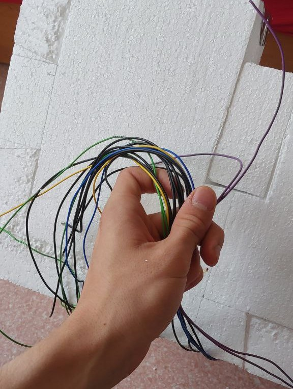

<h1>The Arduino Fermenter with SMS notification.</h1>

The aim of this project was to build a fermenter. The machine, that keeps the temperature inside of it for ome period of time.

The fermenter functionality consits of:

<ul>
  <li>4 independent cells with separate temperature controll.</li>
  <li>Fermenter has nice user interface</li>
  <li>SIM800L module to send messages, when one of the cell is ready</li>
  <li>Thermal isolation</li>
</ul>

<h2>project electronics:</h2>
<ul>
  <li>Heating - 220V/6W heating bulbs</li>
  <li>Temperature measurements - thermistors</li>
  <li>Bulb control - 4 relay modules</li>
  <li>User Interface - Arduino LCD + buttons shield.</li>
  <li>Control Unit - Arduino UNO</li>
  <li>SMS sending - SIM800l module</li>
  <li>The </li>
</ul>

The fermenter itself could be way much more compact. However, the main target was to use the modules, that I already had.

The Arduino UNO could have been replaced by faster, smaller and with less power consumption microcontroller (Like Raspberry PI Pico), but as soon as I had a nice UI shield, I decided to stick to Arduino.

Fermenter blinking:

Fermenter user interface:

